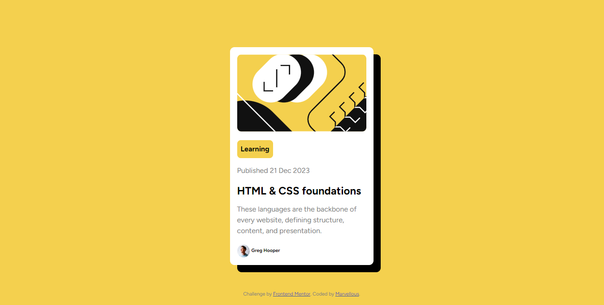

# Frontend Mentor - Blog preview card solution

This is a solution to the [Blog preview card challenge on Frontend Mentor](https://www.frontendmentor.io/challenges/blog-preview-card-ckPaj01IcS). Frontend Mentor challenges help you improve your coding skills by building realistic projects. 

## Table of contents

- [Overview](#overview)
  - [The challenge](#the-challenge)
  - [Screenshot](#screenshot)
  - [Links](#links)
- [My process](#my-process)
  - [Built with](#built-with)
  - [What I learned](#what-i-learned)
  - [Useful resources](#useful-resources)
- [Author](#author)

**Note: Delete this note and update the table of contents based on what sections you keep.**

## Overview

### The challenge

Users should be able to:

- See hover and focus states for all interactive elements on the page

### Screenshot



### Links

- GitHub URL: [Blog Preview Card on GitHub](https://github.com/Marvie-03/BlogPreviewCard-FrontendMentor)
- Live Site URL: [Hosted on Netlify](https://blog-card-fem.netlify.app/)

## My process

### Built with

- Semantic HTML5 markup
- CSS custom properties
- Flexbox
- Mobile-first workflow


### What I learned

I Tried out CSS variables and it was amazing

```css
:root {
  --primary: hsl(47, 88%, 63%);
  --white: hsl(0, 0%, 100%);
  --grey: hsl(0, 0%, 50%);
  --black: hsl(0, 0%, 7%);
}
/* Use Case */
p{
 color: var(--grey);
}
```


### Useful resources

- [W3Schools - CSS Positioning](https://www.w3schools.com/css/css_positioning.asp) - This helped me when I was looking to postion the elements in the card.

## Author

- Website - [Marvellous](https://portfolio-marvel.netlify.app/)
- Frontend Mentor - [@Marvie-03](https://www.frontendmentor.io/profile/Marvie-03)
- Twitter - [@kayveengee](https://www.twitter.com/kayveengee)


